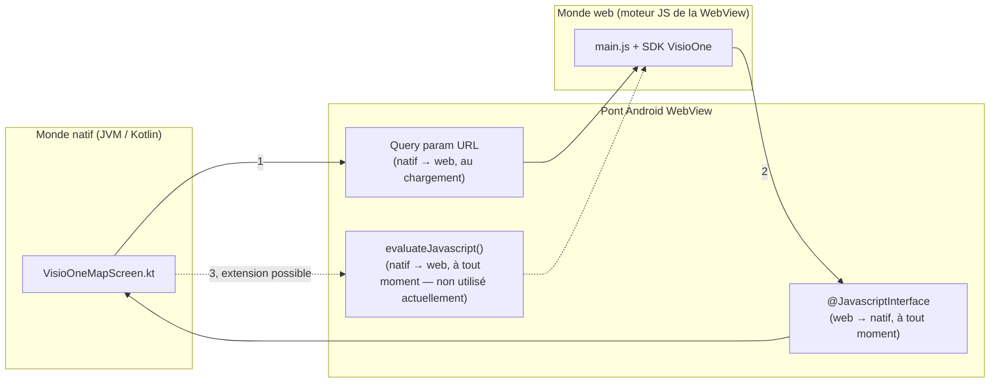
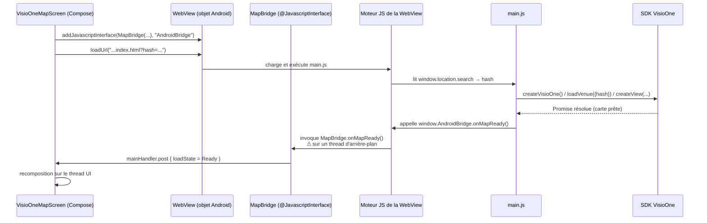

# Communication Application ↔ SDK VisioOne — architecture et guide d'implémentation

Ce document se concentre uniquement sur **le pont de communication** entre le code natif Kotlin/Compose et le SDK JavaScript VisioOne exécuté dans la WebView. Il complète [`GUIDE_RECONSTRUCTION.md`](./GUIDE_RECONSTRUCTION.md) (reconstruire tout le projet) et [`GUIDE_INTEGRATEUR.md`](./GUIDE_INTEGRATEUR.md) (installer et configurer l'app) : ici, l'objectif est de comprendre — et de savoir reproduire ou étendre — **le mécanisme d'échange d'informations** entre les deux mondes.

**Public visé :** développeur Android qui doit ajouter, modifier ou déboguer une communication entre la Compose UI et le SDK VisioOne.

---

## Sommaire

- [1. Le problème : deux runtimes qui ne partagent rien](#1-le-problème--deux-runtimes-qui-ne-partagent-rien)
- [2. Les deux canaux de communication](#2-les-deux-canaux-de-communication)
- [3. Contrat de messages actuel](#3-contrat-de-messages-actuel)
- [4. Cycle de vie complet d'un message](#4-cycle-de-vie-complet-dun-message)
- [5. Lecture du code existant](#5-lecture-du-code-existant)
- [6. Implémenter ce pont pas à pas](#6-implémenter-ce-pont-pas-à-pas)
- [7. Étendre la communication (Native → Web)](#7-étendre-la-communication-native--web)
- [8. Le threading : le piège n°1](#8-le-threading--le-piège-n1)
- [9. Sécurité de `@JavascriptInterface`](#9-sécurité-de-javascriptinterface)
- [10. Déboguer le pont](#10-déboguer-le-pont)
- [11. Bonnes pratiques](#11-bonnes-pratiques)

---

## 1. Le problème : deux runtimes qui ne partagent rien

L'application fait cohabiter deux environnements d'exécution complètement étanches :

- **Le monde natif** : la JVM/ART, qui exécute `MainActivity.kt` et `VisioOneMapScreen.kt` (Kotlin, Compose).
- **Le monde web** : le moteur JavaScript de la WebView (Chromium embarqué), qui exécute `main.js` et le SDK `@visioglobe/visioone`.

Ces deux mondes n'ont **aucune mémoire partagée** : on ne peut pas simplement appeler une fonction Kotlin depuis le JS ou lire une variable JS depuis Kotlin. Toute communication doit passer par une API dédiée fournie par Android :



Ce document détaille les canaux **①** et **②**, qui sont ceux réellement utilisés aujourd'hui, et explique comment ajouter le canal **③** si un besoin futur l'exige (voir [section 7](#7-étendre-la-communication-native--web)).

---

## 2. Les deux canaux de communication

| # | Direction | Mécanisme Android | Quand | Utilisé pour |
|---|---|---|---|---|
| ① | Natif → Web | Paramètre de requête dans l'URL chargée (`loadUrl(...)`) | Une seule fois, au chargement de la page | Transmettre le hash de la carte à afficher |
| ② | Web → Natif | `WebView.addJavascriptInterface()` + méthodes annotées `@JavascriptInterface` | À tout moment, déclenché par le JS | Signaler que la carte est prête ou qu'une erreur est survenue |
| ③ | Natif → Web (après chargement) | `WebView.evaluateJavascript(script, callback)` | À tout moment, déclenché par le natif | Non utilisé aujourd'hui — voir section 7 pour l'ajouter |

Le canal ① est un **canal à sens unique et à usage unique** : une fois l'URL chargée, on ne peut plus renvoyer d'information par ce biais sans recharger toute la page. C'est pourquoi le hash est le seul paramètre transmis ainsi — c'est une donnée de configuration initiale, pas un événement.

Le canal ② est un **canal événementiel** : le JS peut appeler une méthode Kotlin exposée à n'importe quel moment de son exécution, autant de fois que nécessaire.

---

## 3. Contrat de messages actuel

Le "contrat" est l'ensemble des messages que les deux côtés se sont mis d'accord pour échanger. Aujourd'hui, il est volontairement minimal :

| Direction | Message | Payload | Émis par | Reçu par |
|---|---|---|---|---|
| Natif → Web | `?hash=<mapHash>` (query param) | Chaîne de 41 caractères | `VisioOneMapScreen.kt` (`loadUrl`) | `web/src/main.js` (`URLSearchParams`) |
| Web → Natif | `AndroidBridge.onMapReady()` | Aucun | `web/src/main.js`, après `createView()` réussi | `MapBridge.onMapReady()` dans `VisioOneMapScreen.kt` |
| Web → Natif | `AndroidBridge.onMapError(message)` | `String` (message d'erreur) | `web/src/main.js`, dans le `catch` de `main()` | `MapBridge.onMapError()` dans `VisioOneMapScreen.kt` |
| Web → Natif | `AndroidBridge.onPoiClick(payload)` | `String` (JSON : tableau de `{id, name}`) | `web/src/main.js`, listener `view.addEventListener('poiclick', ...)` | `MapBridge.onPoiClick()` dans `FeatureMapScreen.kt` — voir `docs/features/poi-click.md` |

> Note : ce tableau ne couvre que le canal ② (`@JavascriptInterface`). Le canal ③ (`evaluateJavascript`, natif → web) décrit en section 7 comme « non utilisé aujourd'hui » est en réalité déjà utilisé par les features `reset-view` et `occupancy-simulated` (`window.MapBridge.goToGlobal()` / `window.MapBridge.updateOccupancy(...)`, voir `FeatureOverlays.kt` et leurs docs respectives dans `docs/features/`) — ce guide n'a pas été mis à jour à ce moment-là ; à corriger dans une prochaine passe sur ce document.

Toute évolution de la communication (nouvel événement, nouvelle donnée) doit commencer par **ajouter une ligne à ce tableau** avant d'écrire du code — c'est la spécification du pont.

---

## 4. Cycle de vie complet d'un message

Voici la séquence complète, du démarrage de l'app jusqu'à la réception du message `onMapReady` côté Compose :



Le point à retenir : l'appel `MapBridge.onMapReady()` **ne s'exécute pas sur le thread UI**. C'est la raison d'être du `Handler(Looper.getMainLooper())` dans le code — voir [section 8](#8-le-threading--le-piège-n1).

---

## 5. Lecture du code existant

### Côté natif — exposer des méthodes au JS

```kotlin
// app/src/main/java/com/visioglobe/visioonemeet/ui/VisioOneMapScreen.kt

addJavascriptInterface(
    MapBridge(
        onReady = { mainHandler.post { loadState = MapLoadState.Ready } },
        onError = { message -> mainHandler.post { loadState = MapLoadState.Error(message) } },
    ),
    "AndroidBridge",   // <- nom exposé côté JS : window.AndroidBridge
)
```

```kotlin
private class MapBridge(
    private val onReady: () -> Unit,
    private val onError: (String) -> Unit,
) {
    @JavascriptInterface
    fun onMapReady() = onReady()

    @JavascriptInterface
    fun onMapError(message: String) = onError(message)
}
```

Trois règles imposées par Android ici :
- Seules les méthodes annotées `@JavascriptInterface` sont visibles depuis le JS — toute autre méthode publique de la classe reste invisible côté web.
- `addJavascriptInterface` **doit être appelé avant** `loadUrl()`, sinon l'objet n'existe pas encore quand la page démarre.
- Les types de paramètres/retour doivent être des types simples (String, primitives...) — pas d'objets Kotlin complexes.

### Côté web — appeler le pont

```javascript
// web/src/main.js

const bridge = window.AndroidBridge;

async function main() {
  try {
    const visioOne = createVisioOne();
    const venue = await visioOne.loadVenue({ hash });
    await visioOne.createView(container, venue);
    bridge?.onMapReady();
  } catch (error) {
    bridge?.onMapError(String(error?.message ?? error));
  }
}
```

Le `bridge?.` (optional chaining) n'est pas cosmétique : si vous ouvrez `index.html` dans un navigateur classique (via `npm run dev`, par exemple) plutôt que dans la WebView Android, `window.AndroidBridge` n'existe pas. Sans cette précaution, le code planterait en dehors de l'app.

---

## 6. Implémenter ce pont pas à pas

Pour reproduire ce mécanisme dans un nouveau contexte (nouvel écran, nouveau projet), suivez cet ordre :

**Étape 1 — Définir le contrat.** Avant d'écrire du code, listez noir sur blanc : quel événement, dans quel sens, avec quel payload (voir le tableau de la [section 3](#3-contrat-de-messages-actuel) comme modèle).

**Étape 2 — Créer la classe pont côté Kotlin**, avec une méthode `@JavascriptInterface` par message Web → Natif défini à l'étape 1 :

```kotlin
private class MonPont(
    private val onEvenement: (String) -> Unit,
) {
    @JavascriptInterface
    fun surEvenement(donnee: String) = onEvenement(donnee)
}
```

**Étape 3 — Enregistrer le pont avant `loadUrl()`** :

```kotlin
webView.addJavascriptInterface(MonPont(onEvenement = { ... }), "MonPontJs")
webView.loadUrl(url)  // toujours après addJavascriptInterface
```

**Étape 4 — Gérer le threading** : toute mise à jour d'état Compose doit être postée sur le thread principal (voir section 8).

**Étape 5 — Appeler le pont côté JS**, toujours avec un accès défensif (`?.`) :

```javascript
window.MonPontJs?.surEvenement("valeur");
```

**Étape 6 — Tester** en conditions réelles dans la WebView, pas seulement dans un navigateur (voir section 10).

---

## 7. Étendre la communication (Native → Web)

Le canal ① (query param à l'URL) ne convient que pour une configuration initiale. Si un besoin futur exige d'envoyer une information au JS **après** que la page soit déjà chargée (ex. : dire à la carte de centrer une vue sur un POI depuis un bouton natif), il faut utiliser `WebView.evaluateJavascript()` :

```kotlin
// Doit être appelé depuis le thread UI
webView.evaluateJavascript(
    "window.onNativeCommand && window.onNativeCommand('centrerSur', '$poiId')",
    null, // callback optionnel pour récupérer une valeur de retour JS
)
```

Côté JS, il faut alors exposer une fonction globale que le natif peut appeler :

```javascript
window.onNativeCommand = (commande, payload) => {
  if (commande === 'centrerSur') {
    // logique d'appel au SDK VisioOne
  }
};
```

> **Avant d'implémenter un appel `Native → SDK` de ce type**, vérifiez dans la documentation TypeDoc du SDK (`my.visioglobe.com/APIdocs/`) quelles méthodes l'objet `venue` ou la vue créée par `createView()` exposent réellement (sélection de POI, changement d'étage, etc.) — ce guide ne présume d'aucune API au-delà de `createVisioOne`, `loadVenue` et `createView`, qui sont les seules confirmées dans ce projet à ce jour.

---

## 8. Le threading : le piège n°1

Les méthodes annotées `@JavascriptInterface` sont invoquées par la WebView **sur un thread d'arrière-plan**, jamais sur le thread UI. Deux conséquences directes :

1. **Impossible de manipuler l'UI Compose directement** depuis une méthode `@JavascriptInterface` — il faut repasser par le thread principal.
2. C'est exactement le rôle du `Handler(Looper.getMainLooper())` dans le code actuel :

```kotlin
val mainHandler = remember { Handler(Looper.getMainLooper()) }
// ...
onReady = { mainHandler.post { loadState = MapLoadState.Ready } }
```

**Oubli fréquent :** écrire directement `loadState = MapLoadState.Ready` dans le callback `@JavascriptInterface`, sans passer par `mainHandler.post { }`. Le symptôme est souvent un plantage intermittent (`CalledFromWrongThreadException`) qui n'apparaît pas systématiquement en test — donc facile à laisser passer en développement.

---

## 9. Sécurité de `@JavascriptInterface`

Toute méthode annotée `@JavascriptInterface` devient appelable par **n'importe quel JavaScript exécuté dans cette WebView** — pas seulement `main.js`. Trois garde-fous à respecter :

- **Ne jamais exposer de `@JavascriptInterface` sur une WebView qui charge des URLs arbitraires ou du contenu non maîtrisé.** Ici, la WebView ne charge que le bundle local servi par `WebViewAssetLoader` (`https://appassets.androidx.local/assets/www/...`) — jamais une URL externe — ce qui limite la surface d'attaque au code que vous contrôlez vous-même dans `web/`.
- **`minSdk = 26`** dans ce projet est largement au-dessus du seuil (API 17) en dessous duquel `@JavascriptInterface` était vulnérable à l'exécution de code arbitraire par réflexion (CVE historique corrigé par Google depuis Android 4.2). Ne descendez pas `minSdk` sans en avoir conscience.
- **Ne jamais exposer plus de méthodes que nécessaire** sur l'objet pont — chaque méthode `@JavascriptInterface` est une méthode que du JavaScript peut déclencher.

---

## 10. Déboguer le pont

Le débogage à distance de la WebView permet d'inspecter les appels JS ↔ natif en conditions réelles, avec les DevTools Chrome sur votre ordinateur :

1. Ajoutez, en mode debug uniquement, l'activation du débogage distant (absent du code actuel, à ajouter si besoin) :

   ```kotlin
   if (BuildConfig.DEBUG) {
       WebView.setWebContentsDebuggingEnabled(true)
   }
   ```

2. Lancez l'application sur un appareil/émulateur connecté en USB.
3. Sur votre ordinateur, ouvrez Chrome et naviguez vers `chrome://inspect#devices`.
4. La WebView de l'application apparaît dans la liste — cliquez sur **inspect** pour ouvrir les DevTools connectées directement à son contexte JS.
5. Dans la console, vous pouvez appeler manuellement `window.AndroidBridge.onMapReady()` pour vérifier que le pont réagit côté Kotlin, ou poser un `console.log` dans `main.js` pour tracer l'exécution.

---

## 11. Bonnes pratiques

- **Le contrat de messages (section 3) est la source de vérité** — tenez-le à jour à chaque ajout/retrait d'un message, avant même d'écrire le code.
- **Toujours un accès défensif côté JS** (`window.AndroidBridge?.methode()`) pour ne pas dépendre de l'environnement d'exécution (WebView vs navigateur de dev).
- **Toujours reposter sur le thread principal** depuis un callback `@JavascriptInterface` qui touche à l'UI.
- **Limiter le pont au strict nécessaire** : chaque méthode exposée est à la fois une surface de test à couvrir et une surface d'attaque à sécuriser.
- **Ne pas dupliquer le canal ① (query param) pour des événements récurrents** : un query param est lu une seule fois au chargement — pour tout ce qui doit changer après coup, utilisez le canal ③ (`evaluateJavascript`).
