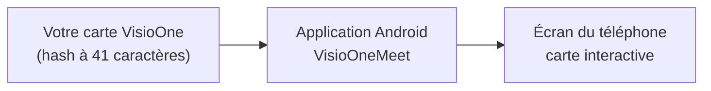
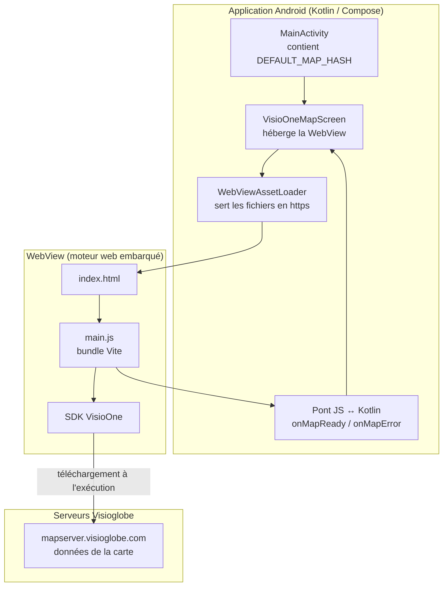
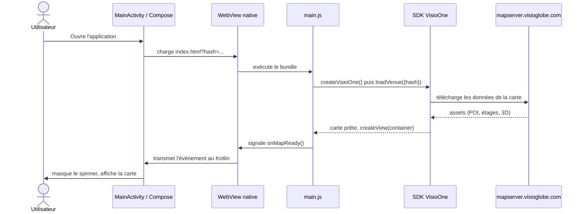
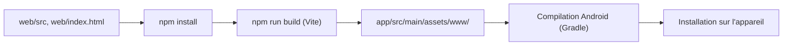

# Guide d'intégration VisioOneMeet — pas à pas pour intégrateur

Ce guide s'adresse à toute personne chargée d'installer, compiler et personnaliser cette application, **sans nécessairement avoir d'expérience préalable avec Android, Kotlin ou Vite**. Chaque étape indique exactement quoi taper, quoi cliquer, et ce que vous devez voir pour savoir que ça a fonctionné.

**Temps estimé :** 45–60 minutes la première fois (installation des outils comprise), 5 minutes ensuite pour reconfigurer une nouvelle carte.

**Ce dont vous avez besoin avant de commencer :**
- Un ordinateur Mac, Windows ou Linux avec une connexion internet.
- Un compte sur [my.visioglobe.com](https://my.visioglobe.com) avec au moins une carte déjà « buildée » par Visioglobe (sinon, contactez votre interlocuteur Visioglobe).
- Un smartphone Android (idéal) ou la volonté d'utiliser un émulateur.

---

## Sommaire

- [Partie A — Comprendre le principe en 2 minutes](#partie-a--comprendre-le-principe-en-2-minutes)
- [Partie B — Installer les outils](#partie-b--installer-les-outils)
- [Partie C — Récupérer le projet](#partie-c--récupérer-le-projet)
- [Partie D — Obtenir le hash de votre carte](#partie-d--obtenir-le-hash-de-votre-carte)
- [Partie E — Configurer la carte à afficher](#partie-e--configurer-la-carte-à-afficher)
- [Partie F — Construire le module web](#partie-f--construire-le-module-web)
- [Partie G — Ouvrir et compiler le projet Android](#partie-g--ouvrir-et-compiler-le-projet-android)
- [Partie H — Lancer l'application](#partie-h--lancer-lapplication)
- [Partie I — Vérifier que tout fonctionne](#partie-i--vérifier-que-tout-fonctionne)
- [Partie J — Dépannage](#partie-j--dépannage)
- [Partie K — Personnalisations courantes](#partie-k--personnalisations-courantes)
- [Annexe — Pour les curieux : le détail technique](#annexe--pour-les-curieux--le-détail-technique)
- [Glossaire](#glossaire)

---

## Partie A — Comprendre le principe en 2 minutes

Vous n'avez pas besoin de savoir programmer en Kotlin pour intégrer cette application. Il suffit de retenir trois choses :

1. **L'application est une coquille native** qui affiche une seule chose : une carte VisioOne, en plein écran.
2. **La carte elle-même est un site web** (le SDK `@visioglobe/visioone`, en JavaScript) que l'on encapsule dans l'application. On ne réécrit jamais ce SDK — on l'installe via `npm` comme n'importe quel projet web.
3. **Une seule information vous permet de choisir quelle carte s'affiche : le « hash »**, une chaîne de 41 caractères propre à chaque carte publiée sur my.visioglobe.com.



Concrètement, intégrer votre propre carte revient à :
- récupérer votre hash (Partie D),
- l'indiquer à l'application (Partie E),
- compiler et installer l'application sur un téléphone (Parties F à H).

Aucune de ces étapes ne demande d'écrire du nouveau code.

---

## Partie B — Installer les outils

Trois outils sont nécessaires. Si l'un est déjà installé sur votre machine, passez simplement au suivant.

### B1. Android Studio (contient déjà Java/JDK)

1. Téléchargez Android Studio depuis [developer.android.com/studio](https://developer.android.com/studio).
2. Lancez l'installeur et laissez les options par défaut (« Standard install »).
3. Au premier lancement, Android Studio propose d'installer le SDK Android — acceptez.
4. Une fois l'assistant terminé, ouvrez **Tools → SDK Manager** (ou l'icône SDK Manager sur l'écran d'accueil).
5. Dans l'onglet **SDK Platforms**, cochez **Android 16.0 ("Baklava") — API 36** (c'est la version ciblée par le projet) puis cliquez **Apply**.

✅ **Vérification :** l'écran d'accueil d'Android Studio s'affiche sans message d'erreur rouge.

> **Pourquoi API 36 précisément ?** Le projet est configuré avec `compileSdk = 36`. Une version de SDK différente et non installée fera échouer la compilation à la Partie G avec une erreur explicite du type « Failed to find target with hash string android-36 ».

### B2. Node.js (pour construire le bundle web)

1. Téléchargez la version **LTS** depuis [nodejs.org](https://nodejs.org) et installez-la (suivant par défaut).
2. Ouvrez un terminal (Terminal sur Mac, PowerShell ou cmd sur Windows) et vérifiez :

```bash
node -v
npm -v
```

✅ **Vérification :** les deux commandes affichent un numéro de version (ex. `v20.x.x` et `10.x.x`) sans erreur « command not found ».

### B3. Un moyen de tester l'application

Deux options, choisissez celle qui vous convient :

- **Téléphone Android physique** (recommandé, plus rapide) : dans les réglages du téléphone, activez le **mode développeur** (allez dans *Paramètres → À propos du téléphone*, appuyez 7 fois sur *Numéro de build*), puis activez **Débogage USB** dans *Paramètres → Options pour développeurs*. Connectez le téléphone en USB à votre ordinateur.
- **Émulateur** : dans Android Studio, ouvrez **Tools → Device Manager → Create device**, choisissez un modèle (ex. Pixel 8), puis une image système **API 34 ou supérieure**. Le premier lancement de l'émulateur peut être lent.

---

## Partie C — Récupérer le projet

Récupérez le dossier du projet (`VisioOneMeetAndroid`) — que ce soit par `git clone` ou par une archive fournie par votre interlocuteur Visioglobe. Vous devez obtenir une arborescence contenant, à la racine, les dossiers `app/`, `web/`, `gradle/` et le fichier `settings.gradle.kts`.

✅ **Vérification :** dans un terminal, placez-vous dans le dossier et lancez :

```bash
ls
```

Vous devez voir apparaître `app`, `web`, `gradlew`, `settings.gradle.kts` parmi les résultats.

---

## Partie D — Obtenir le hash de votre carte

1. Connectez-vous sur [my.visioglobe.com](https://my.visioglobe.com).
2. Ouvrez le projet correspondant à votre carte. **La carte doit déjà avoir été « buildée »** (traitée par les outils Visioglobe) — si ce n'est pas le cas, cette étape doit être faite en amont avec votre contact Visioglobe.
3. Sur la page de la carte publiée, repérez le **hash** : une chaîne de 41 caractères alphanumériques (lettres et chiffres), par exemple :

   ```
   k5f59b8615f0379390e03e4cbe893ff813b9ac94a
   ```

4. Copiez cette chaîne exactement telle quelle — pas d'espace avant/après, respectez les majuscules/minuscules.

> **Vous ne trouvez pas le hash ?** C'est l'information la plus fréquemment mal communiquée entre équipes. Demandez explicitement à votre contact Visioglobe « le hash de build de la carte », pas juste « le lien de la carte » — ce sont deux choses différentes.

---

## Partie E — Configurer la carte à afficher

1. Ouvrez le fichier suivant dans un éditeur de texte (Android Studio, VS Code, ou même le Bloc-notes) :

   ```
   app/src/main/java/com/visioglobe/visioonemeet/MainActivity.kt
   ```

2. Repérez cette ligne, tout en haut du fichier :

   ```kotlin
   private const val DEFAULT_MAP_HASH = "k5f59b8615f0379390e03e4cbe893ff813b9ac94a"
   ```

3. Remplacez la chaîne entre guillemets par le hash récupéré à la Partie D, en gardant les guillemets :

   ```kotlin
   private const val DEFAULT_MAP_HASH = "VOTRE_HASH_ICI"
   ```

4. Enregistrez le fichier.

✅ **Vérification :** la ligne modifiée contient bien vos 41 caractères entre guillemets doubles, sans espace superflu.

> **C'est la seule modification de code nécessaire** pour afficher votre propre carte. Aucun autre fichier n'a besoin d'être touché pour ce cas d'usage.

---

## Partie F — Construire le module web

Le SDK VisioOne est un module JavaScript ; il doit être « empaqueté » une fois avant de pouvoir être intégré à l'application Android. C'est ce que cette étape fait.

1. Ouvrez un terminal et placez-vous dans le sous-dossier `web` du projet :

   ```bash
   cd chemin/vers/VisioOneMeetAndroid/web
   ```

2. Installez les dépendances (télécharge le SDK VisioOne et l'outil de build Vite) :

   ```bash
   npm install
   ```

   Cette commande peut prendre 1 à 2 minutes. Elle affiche en fin d'exécution un résumé du type `added 42 packages in 12s` — c'est normal, même sans erreur affichée en rouge.

3. Construisez le bundle :

   ```bash
   npm run build
   ```

   Vous devez voir un résumé de fichiers générés, se terminant par une ligne du type :

   ```
   ✓ built in 1.2s
   ```

✅ **Vérification :** le dossier `app/src/main/assets/www/` (à la racine du projet, pas dans `web/`) contient maintenant un fichier `index.html` et un sous-dossier `assets/` avec des fichiers `.js`. Si ce dossier est vide ou absent, l'étape a échoué — voir [Partie J — Dépannage](#partie-j--dépannage).

> **Quand refaire cette étape ?** Uniquement si vous modifiez quelque chose dans le dossier `web/` (mise à jour de version du SDK, changement de `web/src/main.js`). Un simple changement de hash (Partie E) ne nécessite **pas** de repasser par cette partie.

---

## Partie G — Ouvrir et compiler le projet Android

1. Lancez Android Studio.
2. Sur l'écran d'accueil, choisissez **Open** (ou **File → Open** si un projet est déjà ouvert).
3. Sélectionnez le dossier racine `VisioOneMeetAndroid` (celui qui contient `settings.gradle.kts`), puis validez.
4. Android Studio lance automatiquement une synchronisation Gradle (barre de progression en bas de la fenêtre, « Gradle Sync »). **Attendez qu'elle se termine** — cela peut prendre plusieurs minutes la première fois, le temps de télécharger les dépendances.

✅ **Vérification :** la barre de progression disparaît et aucune bannière rouge n'apparaît en haut de l'éditeur. Le panneau de gauche (« Project ») affiche l'arborescence `app > src > main > java > com.visioglobe.visioonemeet`.

Si une bannière propose « Install missing SDK component(s) » ou similaire, cliquez sur le lien proposé et laissez l'installation se terminer, puis relancez la synchronisation via **File → Sync Project with Gradle Files**.

---

## Partie H — Lancer l'application

1. En haut de la fenêtre Android Studio, dans le sélecteur d'appareil (à côté du bouton ▶️ vert), choisissez votre téléphone connecté ou l'émulateur créé en Partie B3.
2. Cliquez sur le bouton ▶️ vert (**Run 'app'**).
3. Android Studio compile l'application (première fois : 2 à 5 minutes), l'installe sur l'appareil, puis la lance automatiquement.

**Alternative en ligne de commande**, si vous préférez ne pas utiliser l'interface d'Android Studio (téléphone branché en USB requis) :

```bash
cd VisioOneMeetAndroid
./gradlew installDebug
adb shell am start -n com.visioglobe.visioonemeet/.MainActivity
```

---

## Partie I — Vérifier que tout fonctionne

À l'ouverture, vous devez voir dans l'ordre :

1. Un écran blanc avec un **cercle de chargement** (spinner) au centre.
2. **Patientez 20 à 30 secondes** au premier lancement sur un appareil ou émulateur neuf — le temps que le téléphone télécharge les données 3D de la carte depuis les serveurs Visioglobe. Ce n'est pas un blocage, même si ça semble long.
3. La carte apparaît : bâtiments, sélecteur d'étage, barre de recherche.

| Ce que vous voyez | Signification |
|---|---|
| Spinner qui tourne depuis moins de 30s | Normal, patientez |
| Spinner qui tourne depuis plus de 2 minutes | Problème réseau ou hash incorrect — voir Partie J |
| Message rouge « Impossible de charger la carte VisioOne » | Le hash est probablement invalide — revérifiez la Partie E |
| Carte affichée avec bâtiments et étages | ✅ Tout fonctionne |

---

## Partie J — Dépannage

| Symptôme | Cause probable | Solution |
|---|---|---|
| `Failed to find target with hash string 'android-36'` à la compilation | Le SDK Android 36 n'est pas installé | Ouvrez **Tools → SDK Manager**, cochez API 36, appliquez (Partie B1) |
| `no longer required for Kotlin support since AGP 9.0` | Un plugin Kotlin en trop a été ajouté dans un fichier `build.gradle.kts` | Vérifiez qu'aucun fichier n'applique `org.jetbrains.kotlin.android` — seul `org.jetbrains.kotlin.plugin.compose` doit être présent |
| `npm: command not found` | Node.js n'est pas installé ou le terminal n'a pas été redémarré après l'installation | Réinstallez Node.js (Partie B2), fermez et rouvrez le terminal |
| Le dossier `app/src/main/assets/www/` reste vide après `npm run build` | La commande a été lancée depuis le mauvais dossier (racine du projet au lieu de `web/`) | Vérifiez que vous êtes bien dans `web/` avant de lancer `npm install` / `npm run build` |
| Message rouge « Impossible de charger la carte VisioOne » avec un message d'erreur réseau | Pas de connexion internet sur l'appareil de test, ou hash invalide | Vérifiez le Wi-Fi/données mobiles de l'appareil, puis revérifiez le hash (Partie D et E) |
| L'appareil physique n'apparaît pas dans le sélecteur d'Android Studio | Débogage USB non activé, ou câble USB de charge uniquement | Activez le débogage USB (Partie B3), utilisez un câble USB permettant le transfert de données, acceptez la popup « Autoriser le débogage USB » sur le téléphone |
| Gradle Sync échoue avec une erreur de version Kotlin ou AndroidX | Version d'outil non installée localement (ex. compileSdk trop récent pour un composant AndroidX) | Alignez les versions dans `gradle/libs.versions.toml` sur ce que votre installation locale supporte, en particulier `coreKtx` |

Si aucune de ces solutions ne résout le problème, notez le message d'erreur complet (visible dans l'onglet **Build** ou **Logcat** d'Android Studio) avant de contacter votre interlocuteur Visioglobe — cela accélère grandement le diagnostic.

---

## Partie K — Personnalisations courantes

Ces personnalisations ne nécessitent pas de reconstruire le module web (Partie F) — seulement une recompilation Android (Partie G/H) :

- **Nom de l'application** : fichier `app/src/main/res/values/strings.xml`, valeur `app_name`.
- **Icône de l'application** : remplacez les fichiers sous `app/src/main/res/mipmap-anydpi-v26/`.
- **Couleurs du thème (loader, écran d'erreur)** : fichier `app/src/main/java/com/visioglobe/visioonemeet/ui/theme/Color.kt`.
- **Changer de carte à nouveau** : reprenez la Partie E avec un nouveau hash.

Ces personnalisations nécessitent de reconstruire le module web (Partie F) **avant** de recompiler l'application :

- **Mettre à jour la version du SDK VisioOne** : dans `web/package.json`, changez le numéro de version de `@visioglobe/visioone`, puis relancez `npm install && npm run build`.
- **Modifier le comportement au chargement de la carte** (ex. ajouter un log, changer le comportement en cas d'erreur) : éditez `web/src/main.js`, puis relancez `npm run build`.

---

## Annexe — Pour les curieux : le détail technique

Cette section n'est pas nécessaire pour intégrer l'application — elle explique ce qui se passe « sous le capot », pour qui souhaite aller plus loin ou déboguer un cas non couvert par la Partie J.

### Architecture en couches



### Séquence complète, du lancement à l'affichage



### Pipeline de build



Un guide plus détaillé, orienté reconstruction complète du projet fichier par fichier, est disponible dans [`GUIDE_RECONSTRUCTION.md`](./GUIDE_RECONSTRUCTION.md).

---

## Glossaire

| Terme | Signification |
|---|---|
| **Hash** | Identifiant unique à 41 caractères d'une carte VisioOne publiée, obtenu sur my.visioglobe.com |
| **WebView** | Composant Android qui affiche des pages web à l'intérieur d'une application native |
| **Bundle web** | L'ensemble des fichiers JavaScript/HTML générés par Vite, prêts à être servis par la WebView |
| **Gradle** | L'outil qui compile le projet Android (équivalent d'un `make` ou `npm run build` pour Android) |
| **AGP** | Android Gradle Plugin, le plugin qui permet à Gradle de comprendre les projets Android |
| **Sync Gradle** | L'étape où Android Studio relit la configuration du projet et télécharge les dépendances |
| **AVD** | Android Virtual Device, un émulateur de téléphone Android sur votre ordinateur |
| **APK** | Le fichier final installable d'une application Android |
| **npm** | Le gestionnaire de paquets de l'écosystème JavaScript/Node.js, utilisé ici pour installer le SDK VisioOne |
