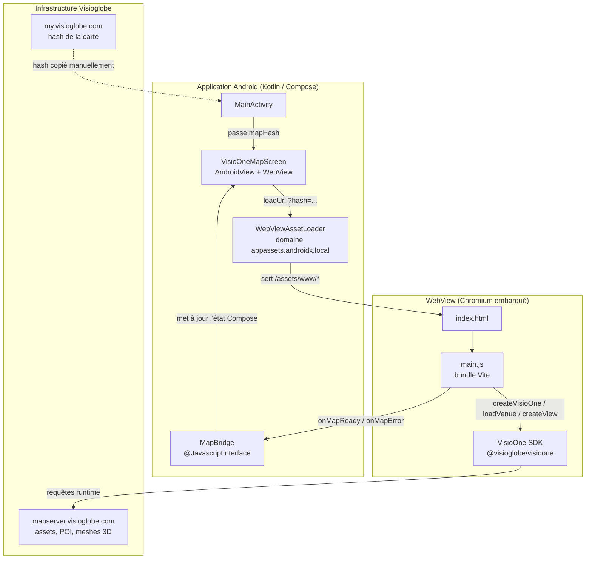
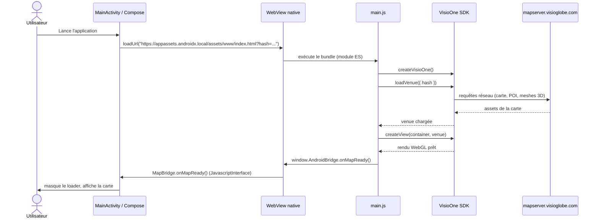
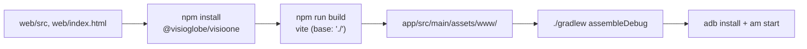

# Recréer VisioOneMeet, pas à pas

Une application Android (Kotlin + Jetpack Compose) qui affiche un plan intérieur VisioOne dans une WebView, en pontant un bundle web Vite avec la couche native via `WebViewAssetLoader`.

**Stack :** Kotlin 2.2.20 · Jetpack Compose · AGP 9.3.0 · Gradle 9.6.1 · Vite 5 · `@visioglobe/visioone` 1.0.5

## Sommaire

1. [Vue d'ensemble](#1-vue-densemble)
2. [Architecture générale](#2-architecture-générale)
3. [Flux d'exécution](#3-flux-dexécution)
4. [Prérequis](#4-prérequis)
5. [Étape 1 — Squelette du projet Android](#étape-1--squelette-du-projet-android)
6. [Étape 2 — Module `app`](#étape-2--configurer-le-module-app)
7. [Étape 3 — Manifeste](#étape-3--déclarer-le-manifeste)
8. [Étape 4 — Sous-projet `web/`](#étape-4--sous-projet-web)
9. [Étape 5 — Build du bundle web](#étape-5--construire-le-bundle-web)
10. [Étape 6 — Écran WebView](#étape-6--écrire-lécran-webview)
11. [Étape 7 — MainActivity](#étape-7--câbler-mainactivity)
12. [Étape 8 — Compiler et lancer](#étape-8--compiler-et-lancer)
13. [Pièges connus](#pièges-connus)
14. [Pour aller plus loin](#pour-aller-plus-loin)

---

## 1. Vue d'ensemble

L'application n'a qu'un seul écran : une carte intérieure VisioOne plein écran. Plutôt que d'utiliser un SDK Android natif, elle charge le SDK JavaScript `@visioglobe/visioone` dans une `WebView`, avec un vrai bundle Vite construit à la compilation (pas un simple chargement depuis un CDN). Deux repères à garder en tête pendant tout le guide :

- La carte est identifiée par un **hash** de 41 caractères obtenu sur [my.visioglobe.com](https://my.visioglobe.com) (une fois la carte « buildée »). Exemple utilisé ici : `k5f59b8615f0379390e03e4cbe893ff813b9ac94a`.
- Les assets de la carte (POI, étages, meshes 3D) ne sont **pas** embarqués dans l'APK : ils sont téléchargés à l'exécution depuis `mapserver.visioglobe.com`, donc le premier chargement sur émulateur peut prendre 20–30 secondes (gros chunk JS + initialisation WebGL).

## 2. Architecture générale

Quatre couches distinctes se parlent : l'UI native Compose, le pont natif WebView, le bundle web qui embarque le SDK, et l'infrastructure distante Visioglobe.



Le pont clé est `WebViewAssetLoader` : il sert les fichiers de `assets/www/` sur une origine `https://` synthétique, ce qui évite les blocages CORS que `file://` imposerait aux imports ES modules du bundle Vite.

| Couche | Rôle | Fichier clé |
|---|---|---|
| UI native | Affiche le loader / l'erreur, héberge la WebView | `VisioOneMapScreen.kt` |
| Pont natif | Sert les assets en https synthétique, expose `AndroidBridge` | `WebViewAssetLoader`, `MapBridge` |
| Bundle web | Initialise le SDK, lit le hash en query param | `web/src/main.js` |
| Infra distante | Sert les assets de la carte à l'exécution | `mapserver.visioglobe.com` |

## 3. Flux d'exécution

Séquence complète depuis le lancement de l'app jusqu'à l'affichage de la carte :



En cas d'échec (hash invalide, réseau indisponible), `main.js` attrape l'erreur et appelle `onMapError(message)`, que Compose reflète en texte d'erreur.

## 4. Prérequis

- Android Studio récent avec le SDK Android **compileSdk 36** installé (voir le piège AGP 9 plus bas si vous n'avez que le SDK 36 disponible).
- JDK 17.
- Node.js + npm, pour construire le sous-projet `web/` avec Vite.
- Un compte [my.visioglobe.com](https://my.visioglobe.com) avec au moins une carte « buildée », pour récupérer son hash (41 caractères alphanumériques).

## Étape 1 — Squelette du projet Android

Un projet Gradle Kotlin DSL à un seul module (`:app`), avec un version catalog pour les dépendances.

**`settings.gradle.kts`**
```kotlin
pluginManagement {
    repositories {
        google()
        mavenCentral()
        gradlePluginPortal()
    }
}

dependencyResolutionManagement {
    repositoriesMode.set(RepositoriesMode.FAIL_ON_PROJECT_REPOS)
    repositories {
        google()
        mavenCentral()
    }
}

rootProject.name = "VisioOneMeet"
include(":app")
```

**`build.gradle.kts` (racine)**
```kotlin
plugins {
    alias(libs.plugins.android.application) apply false
    alias(libs.plugins.kotlin.compose) apply false
}
```

**`gradle/libs.versions.toml`**
```toml
[versions]
agp = "9.3.0"
kotlin = "2.2.20"
coreKtx = "1.17.0"
lifecycleRuntimeKtx = "2.10.0"
activityCompose = "1.13.0"
composeBom = "2026.06.01"
webkit = "1.16.0"

[libraries]
androidx-core-ktx = { group = "androidx.core", name = "core-ktx", version.ref = "coreKtx" }
androidx-lifecycle-runtime-ktx = { group = "androidx.lifecycle", name = "lifecycle-runtime-ktx", version.ref = "lifecycleRuntimeKtx" }
androidx-activity-compose = { group = "androidx.activity", name = "activity-compose", version.ref = "activityCompose" }
androidx-compose-bom = { group = "androidx.compose", name = "compose-bom", version.ref = "composeBom" }
androidx-ui = { group = "androidx.compose.ui", name = "ui" }
androidx-ui-graphics = { group = "androidx.compose.ui", name = "ui-graphics" }
androidx-ui-tooling = { group = "androidx.compose.ui", name = "ui-tooling" }
androidx-ui-tooling-preview = { group = "androidx.compose.ui", name = "ui-tooling-preview" }
androidx-material3 = { group = "androidx.compose.material3", name = "material3" }
androidx-webkit = { group = "androidx.webkit", name = "webkit", version.ref = "webkit" }

[plugins]
android-application = { id = "com.android.application", version.ref = "agp" }
kotlin-compose = { id = "org.jetbrains.kotlin.plugin.compose", version.ref = "kotlin" }
```

Puis générez le wrapper Gradle en 9.6.1 :

```bash
brew install gradle
gradle wrapper --gradle-version 9.6.1
```

## Étape 2 — Configurer le module `app`

Notez l'absence du plugin `org.jetbrains.kotlin.android` : sous AGP 9, le support Kotlin est intégré, ce plugin échoue au build s'il est appliqué.

**`app/build.gradle.kts`**
```kotlin
plugins {
    alias(libs.plugins.android.application)
    alias(libs.plugins.kotlin.compose)
}

android {
    namespace = "com.visioglobe.visioonemeet"
    compileSdk = 36

    defaultConfig {
        applicationId = "com.visioglobe.visioonemeet"
        minSdk = 26
        targetSdk = 36
        versionCode = 1
        versionName = "1.0"
    }

    buildTypes {
        release {
            isMinifyEnabled = false
            proguardFiles(getDefaultProguardFile("proguard-android-optimize.txt"), "proguard-rules.pro")
        }
    }

    compileOptions {
        sourceCompatibility = JavaVersion.VERSION_17
        targetCompatibility = JavaVersion.VERSION_17
    }

    buildFeatures {
        compose = true
    }
}

dependencies {
    implementation(libs.androidx.core.ktx)
    implementation(libs.androidx.lifecycle.runtime.ktx)
    implementation(libs.androidx.activity.compose)
    implementation(platform(libs.androidx.compose.bom))
    implementation(libs.androidx.ui)
    implementation(libs.androidx.ui.graphics)
    implementation(libs.androidx.ui.tooling.preview)
    implementation(libs.androidx.material3)
    implementation(libs.androidx.webkit)
    debugImplementation(libs.androidx.ui.tooling)
}
```

## Étape 3 — Déclarer le manifeste

La seule permission requise est `INTERNET`, puisque tout le contenu de la carte est chargé à distance.

**`app/src/main/AndroidManifest.xml`**
```xml
<?xml version="1.0" encoding="utf-8"?>
<manifest xmlns:android="http://schemas.android.com/apk/res/android">

    <!-- VisioOne charge les données de carte (POI, étages, modèles 3D) depuis mapserver.visioglobe.com à l'exécution. -->
    <uses-permission android:name="android.permission.INTERNET" />

    <application
        android:allowBackup="true"
        android:hardwareAccelerated="true"
        android:icon="@mipmap/ic_launcher"
        android:label="@string/app_name"
        android:theme="@style/Theme.VisioOneMeet"
        android:supportsRtl="true">

        <activity
            android:name=".MainActivity"
            android:exported="true"
            android:theme="@style/Theme.VisioOneMeet"
            android:configChanges="orientation|screenSize|screenLayout|keyboardHidden">
            <intent-filter>
                <action android:name="android.intent.action.MAIN" />
                <category android:name="android.intent.category.LAUNCHER" />
            </intent-filter>
        </activity>
    </application>

</manifest>
```

## Étape 4 — Sous-projet `web/`

C'est un projet Vite indépendant, séparé du projet Gradle, dont la seule mission est d'installer le SDK npm et de produire un bundle statique directement dans `app/src/main/assets/www/`.

**`web/package.json`**
```json
{
  "name": "visioone-webview",
  "private": true,
  "version": "1.0.0",
  "type": "module",
  "description": "Minimal web page embedding the VisioOne SDK, bundled for use inside the Android app's WebView.",
  "scripts": {
    "dev": "vite",
    "build": "vite build"
  },
  "dependencies": {
    "@visioglobe/visioone": "1.0.5"
  },
  "devDependencies": {
    "vite": "^5.4.0"
  }
}
```

**`web/vite.config.js`**
```javascript
import { defineConfig } from 'vite';

// Le build est servi par l'app Android via WebViewAssetLoader sur
// https://appassets.androidx.local/assets/www/, donc chaque chemin d'asset
// doit rester relatif.
export default defineConfig({
  base: './',
  build: {
    outDir: '../app/src/main/assets/www',
    emptyOutDir: true,
  },
});
```

**`web/index.html`**
```html
<!DOCTYPE html>
<html lang="en">
<head>
  <meta charset="UTF-8" />
  <meta name="viewport" content="width=device-width, initial-scale=1, maximum-scale=1, user-scalable=no" />
  <title>VisioOne Map</title>
  <style>
    html, body {
      margin: 0;
      padding: 0;
      width: 100%;
      height: 100%;
      overflow: hidden;
      background: #ffffff;
    }
    #content {
      width: 100%;
      height: 100%;
    }
  </style>
</head>
<body>
  <div id="content"></div>
  <script type="module" src="/src/main.js"></script>
</body>
</html>
```

**`web/src/main.js`**
```javascript
import { createVisioOne } from '@visioglobe/visioone';

// L'app Android ajoute ?hash=<mapHash> en chargeant cette page (voir
// VisioOneMapScreen.kt), donc le même bundle peut afficher n'importe quelle
// carte sans reconstruction.
const DEFAULT_HASH = 'k5f59b8615f0379390e03e4cbe893ff813b9ac94a';
const hash = new URLSearchParams(window.location.search).get('hash') || DEFAULT_HASH;

const container = document.querySelector('#content');

// Pont optionnel injecté par MainActivity via WebView.addJavascriptInterface,
// utilisé pour refléter l'état de chargement de la carte dans l'UI Compose native.
const bridge = window.AndroidBridge;

async function main() {
  try {
    const visioOne = createVisioOne();
    const venue = await visioOne.loadVenue({ hash });
    await visioOne.createView(container, venue);
    bridge?.onMapReady();
  } catch (error) {
    bridge?.onMapError(String(error?.message ?? error));
  }
}

main();
```

## Étape 5 — Construire le bundle web

Depuis `web/`, installez la dépendance npm puis lancez le build Vite — la sortie remplace directement le contenu de `app/src/main/assets/www/` :

```bash
cd web
npm install
npm run build
```

À chaque changement dans `web/` (mise à jour du SDK, logique de `main.js`...), il faut relancer `npm run build` avant de recompiler l'APK — Gradle ne sait pas que `web/` existe et ne le reconstruit pas pour vous.

## Étape 6 — Écrire l'écran WebView

Le composant central du pont natif. Trois responsabilités : configurer `WebViewAssetLoader` pour servir `assets/www/` sur une origine https synthétique, exposer un `@JavascriptInterface` pour que le JS notifie l'état de chargement, et refléter cet état dans l'UI Compose (loader / erreur / carte).

**`app/src/main/java/.../ui/VisioOneMapScreen.kt`**
```kotlin
package com.visioglobe.visioonemeet.ui

import android.os.Handler
import android.os.Looper
import android.view.ViewGroup
import android.webkit.JavascriptInterface
import android.webkit.WebResourceRequest
import android.webkit.WebResourceResponse
import android.webkit.WebView
import android.webkit.WebViewClient
import androidx.compose.foundation.layout.Box
import androidx.compose.foundation.layout.fillMaxSize
import androidx.compose.foundation.layout.padding
import androidx.compose.material3.CircularProgressIndicator
import androidx.compose.material3.MaterialTheme
import androidx.compose.material3.Text
import androidx.compose.runtime.Composable
import androidx.compose.runtime.getValue
import androidx.compose.runtime.mutableStateOf
import androidx.compose.runtime.remember
import androidx.compose.runtime.setValue
import androidx.compose.ui.Alignment
import androidx.compose.ui.Modifier
import androidx.compose.ui.text.style.TextAlign
import androidx.compose.ui.unit.dp
import androidx.compose.ui.viewinterop.AndroidView
import androidx.webkit.WebViewAssetLoader

private const val ASSET_LOADER_DOMAIN = "appassets.androidx.local"

private sealed interface MapLoadState {
    data object Loading : MapLoadState
    data object Ready : MapLoadState
    data class Error(val message: String) : MapLoadState
}

/**
 * Hosts the VisioOne JS SDK inside a WebView. The SDK is bundled with Vite (see /web) and
 * served from the app's assets through [WebViewAssetLoader], which exposes it on a synthetic
 * https:// origin instead of file:// so ES module imports resolve without CORS issues.
 */
@Composable
fun VisioOneMapScreen(mapHash: String, modifier: Modifier = Modifier) {
    var loadState by remember { mutableStateOf<MapLoadState>(MapLoadState.Loading) }
    val mainHandler = remember { Handler(Looper.getMainLooper()) }

    Box(modifier = modifier.fillMaxSize()) {
        AndroidView(
            modifier = Modifier.fillMaxSize(),
            factory = { context ->
                val assetLoader = WebViewAssetLoader.Builder()
                    .setDomain(ASSET_LOADER_DOMAIN)
                    .addPathHandler("/assets/", WebViewAssetLoader.AssetsPathHandler(context))
                    .build()

                WebView(context).apply {
                    layoutParams = ViewGroup.LayoutParams(
                        ViewGroup.LayoutParams.MATCH_PARENT,
                        ViewGroup.LayoutParams.MATCH_PARENT,
                    )

                    settings.javaScriptEnabled = true
                    settings.domStorageEnabled = true
                    settings.mediaPlaybackRequiresUserGesture = false

                    addJavascriptInterface(
                        MapBridge(
                            onReady = { mainHandler.post { loadState = MapLoadState.Ready } },
                            onError = { message -> mainHandler.post { loadState = MapLoadState.Error(message) } },
                        ),
                        "AndroidBridge",
                    )

                    webViewClient = object : WebViewClient() {
                        override fun shouldInterceptRequest(
                            view: WebView,
                            request: WebResourceRequest,
                        ): WebResourceResponse? = assetLoader.shouldInterceptRequest(request.url)
                    }

                    loadUrl("https://$ASSET_LOADER_DOMAIN/assets/www/index.html?hash=$mapHash")
                }
            },
        )

        when (val state = loadState) {
            is MapLoadState.Loading -> CircularProgressIndicator(modifier = Modifier.align(Alignment.Center))

            is MapLoadState.Error -> Text(
                text = "Impossible de charger la carte VisioOne :\n${state.message}",
                modifier = Modifier
                    .align(Alignment.Center)
                    .padding(24.dp),
                textAlign = TextAlign.Center,
                color = MaterialTheme.colorScheme.error,
            )

            is MapLoadState.Ready -> Unit
        }
    }
}

private class MapBridge(
    private val onReady: () -> Unit,
    private val onError: (String) -> Unit,
) {
    @JavascriptInterface
    fun onMapReady() = onReady()

    @JavascriptInterface
    fun onMapError(message: String) = onError(message)
}
```

> **Pourquoi `WebViewAssetLoader` et pas `file://` ?**
> Charger `index.html` directement en `file://` casse les imports dynamiques des modules ES du bundle Vite (WebView applique une politique CORS stricte aux origines `file://`). `WebViewAssetLoader` contourne ce problème en servant les mêmes fichiers sur une origine `https://appassets.androidx.local/`, traitée comme une vraie origine web.

## Étape 7 — Câbler `MainActivity`

L'activité ne fait qu'injecter le hash de la carte par défaut et poser l'écran Compose en plein écran. Changer de carte ne demande donc *aucun* rebuild du bundle web : il suffit d'éditer cette constante.

**`app/src/main/java/.../MainActivity.kt`**
```kotlin
package com.visioglobe.visioonemeet

import android.os.Bundle
import androidx.activity.ComponentActivity
import androidx.activity.compose.setContent
import androidx.compose.foundation.layout.fillMaxSize
import androidx.compose.ui.Modifier
import com.visioglobe.visioonemeet.ui.VisioOneMapScreen
import com.visioglobe.visioonemeet.ui.theme.VisioOneMeetTheme

/** Hash of the VisioOne map to display, as found on the my.visioglobe.com portal. */
private const val DEFAULT_MAP_HASH = "k5f59b8615f0379390e03e4cbe893ff813b9ac94a"

class MainActivity : ComponentActivity() {
    override fun onCreate(savedInstanceState: Bundle?) {
        super.onCreate(savedInstanceState)
        setContent {
            VisioOneMeetTheme {
                VisioOneMapScreen(
                    mapHash = DEFAULT_MAP_HASH,
                    modifier = Modifier.fillMaxSize(),
                )
            }
        }
    }
}
```

## Étape 8 — Compiler et lancer

Le pipeline complet, du bundle web à l'APK installé, tient en cinq maillons :



```bash
./gradlew assembleDebug
adb install -r app/build/outputs/apk/debug/app-debug.apk
adb shell am start -n com.visioglobe.visioonemeet/.MainActivity
```

Sur un émulateur Pixel 8 Pro API 34, le premier chargement à froid prend 20 à 30 secondes (chunk JS principal d'environ 4,7 Mo + assets de carte + initialisation WebGL) : le loader circulaire qui tourne longtemps n'est pas un signe de blocage.

## Pièges connus

> **AGP 9 et le plugin Kotlin**
> Depuis AGP 9.0, le support Kotlin est intégré nativement : appliquer `org.jetbrains.kotlin.android` échoue avec « no longer required for Kotlin support since AGP 9.0 ». Ne gardez que `org.jetbrains.kotlin.plugin.compose`, requis pour le compilateur Compose.

> **compileSdk et core-ktx**
> Les versions récentes d'AndroidX (ex. core-ktx 1.19.0) exigent `compileSdk 37`. Si seul le SDK 36 est installé localement, épinglez `core-ktx` à `1.17.0` plutôt que d'installer une plateforme supplémentaire.

> **Wrapper Gradle absent**
> Si le projet ne contient pas encore de wrapper, installez Gradle localement (`brew install gradle`) puis générez-le avec `gradle wrapper --gradle-version 9.6.1` plutôt que de committer un wrapper téléchargé à la main.

> **CORS sous file://**
> Ne chargez jamais le bundle avec `webView.loadUrl("file:///android_asset/www/index.html")` : les imports ES modules du build Vite échoueront silencieusement. Utilisez systématiquement `WebViewAssetLoader`.

## Pour aller plus loin

- **Changer de carte sans rebuild :** le hash est lu en query string par `web/src/main.js` — modifiez uniquement `DEFAULT_MAP_HASH` dans `MainActivity.kt` et recompilez l'APK, sans repasser par `npm run build`.
- **Itérer sur le bundle web :** `npm run dev` dans `web/` lance un serveur Vite local pour prototyper l'intégration du SDK dans un vrai navigateur avant de la rebasculer dans la WebView.
- **Étendre le pont natif :** d'autres méthodes `@JavascriptInterface` peuvent être ajoutées à `MapBridge` pour exposer des événements de carte (sélection de POI, changement d'étage) côté Compose.

---

*Guide généré à partir de l'état actuel du dépôt `VisioOneMeetAndroid` (module `app/` + sous-projet `web/`).*
